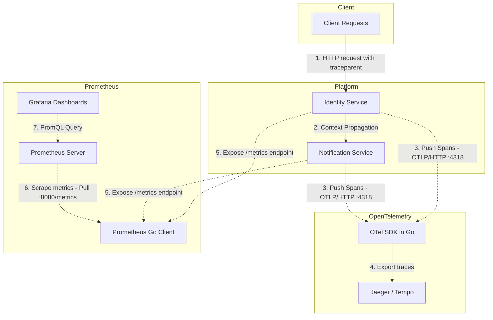
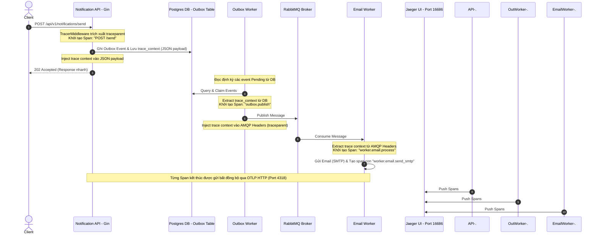
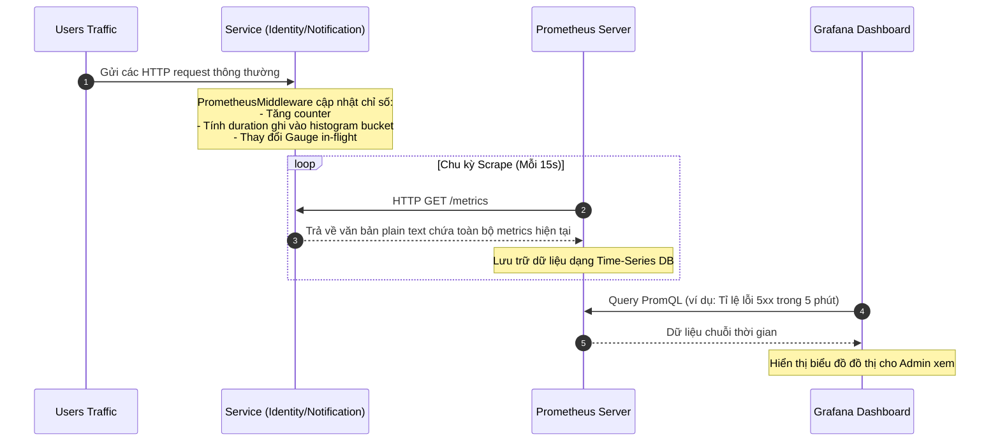

# Kiến trúc Observability: Prometheus và OpenTelemetry trong Microservices Base Platform

Tài liệu này mô tả chi tiết cách hoạt động, kiến trúc ranh giới, luồng dữ liệu và điểm khác biệt cốt lõi giữa **Prometheus** (Metrics) và **OpenTelemetry** (Distributed Tracing) được áp dụng trong dự án của bạn.

---

## 1. Bản Đồ Tổng Quan Observability (Trụ Cột Giám Sát)

Hệ thống của bạn sử dụng hai công cụ này để giải quyết hai bài toán khác nhau nhưng bổ trợ lẫn nhau:



---

## 2. Chi Tiết Về OpenTelemetry (Distributed Tracing)

### A. Vai trò trong dự án
OpenTelemetry trong dự án của bạn được cấu hình làm **Tracer Provider** nhằm theo dõi hành trình của từng request đi qua các ranh giới dịch vụ khác nhau. Nó giúp bạn trả lời câu hỏi:
- *Request này đi qua những rào cản xử lý nào?*
- *Phần nào (HTTP router, database, RabbitMQ, SMTP client) mất nhiều thời gian nhất?*
- *Lỗi xảy ra ở mắt xích nào trong chuỗi bất đồng bộ?*

### B. Cơ chế truyền dẫn ngữ cảnh (Context Propagation)
Đặc thù dự án của bạn sử dụng mô hình **Transactional Outbox Pattern** và **RabbitMQ** để xử lý hàng đợi bất đồng bộ. Nếu không truyền Context, luồng tracing sẽ bị ngắt quãng. OTel đã được tích hợp để giải quyết bài toán này qua 3 ranh giới:

1. **Ranh giới HTTP (Gin Middleware):**
   - Bộ [TracerMiddleware](file:///d:/BACKEND/PROJECTS/microservices-base-platform/pkg/trace/trace.go#L145-L192) tự động trích xuất (`Extract`) thông tin trace từ HTTP Header `traceparent` (nếu có từ Gateway) bằng `W3C TraceContext`.
   - Tạo server span mới và tự động cập nhật vào `context.Context` của Go.
2. **Ranh giới Database (Transactional Outbox):**
   - Trước khi lưu một sự kiện Outbox vào PostgreSQL, Notification Service gọi `trace.InjectMap(ctx)` để chuyển trạng thái trace hiện tại thành `map[string]string` và lưu vào cột `trace_context` (nằm trong JSON/JSONB `payload` của bảng `outbox_events`).
   - Khi Outbox Worker quét bản ghi đó lên, nó gọi `trace.ExtractMap(ctx, payload["trace_context"])` để khôi phục lại ngữ cảnh trace và tạo span con `outbox.publish`.
3. **Ranh giới Message Queue (RabbitMQ):**
   - Trước khi gửi tin nhắn, hàm `Publish` của RabbitMQ client gọi `trace.InjectAMQP(ctx, headers)` để chèn trace context vào AMQP headers (`traceparent`).
   - Khi `EmailWorker` hoặc consumer khác nhận tin nhắn, wrapper RabbitMQ gọi `trace.ExtractAMQP(ctx, headers)` để khôi phục ngữ cảnh trace trước khi chuyển qua handler xử lý công việc gửi email (`worker.email.process`).

### C. Sơ đồ Luồng Tracing Chi Tiết trong Dự Án
Dưới đây là hành trình của 1 trace đi qua toàn bộ Notification Service:



---

## 3. Chi Tiết Về Prometheus (Metrics Monitoring)

### A. Vai trò trong dự án
Prometheus chịu trách nhiệm đo lường hiệu năng tổng quan của ứng dụng theo thời gian thực (Time-series data). Nó không đi sâu vào từng request cá biệt (như Tracing) mà tập trung vào **số liệu thống kê gộp** của toàn hệ thống dựa trên phương pháp **RED** (Rate - Errors - Duration):
- **Rate (Tần suất):** Có bao nhiêu request đang đến mỗi giây? (Ví dụ: `identity_http_requests_total`).
- **Errors (Tỉ lệ lỗi):** Bao nhiêu phần trăm request trả về HTTP 5xx?
- **Duration (Độ trễ):** Thời gian phản hồi trung bình hoặc p95, p99 là bao nhiêu? (Ví dụ: `identity_http_request_duration_seconds`).

### B. Cơ chế thu thập Metrics (Pull Model)
Khác với OpenTelemetry (đẩy data chủ động), Prometheus hoạt động theo cơ chế **Kéo (Pull/Scraping)** định kỳ:

1. **Khai báo Metrics (App side):**
   Trong code ứng dụng của bạn (ví dụ: [metrics.go](file:///d:/BACKEND/PROJECTS/microservices-base-platform/services/identity/internal/middleware/metrics.go)), các biến metric được khởi tạo qua thư viện Go client của Prometheus (`prometheus/client_golang`):
   - `httpRequestsTotal` (Counter): Đếm số lượng request tăng dần, phân nhóm theo labels (`method`, `path`, `status`).
   - `httpRequestDuration` (Histogram): Đo thời gian xử lý và phân nhóm vào các bucket định sẵn.
   - `httpRequestsInFlight` (Gauge): Theo dõi số lượng request đồng thời đang chạy (có thể tăng hoặc giảm).
2. **Expose Endpoint:**
   - Ứng dụng đăng ký route `/metrics` bằng cách wrap http handler của Prometheus: `r.GET("/metrics", gin.WrapH(promhttp.Handler()))`.
3. **Scraping (Prometheus Server side):**
   - Prometheus server được deploy trong Kubernetes/Docker Compose sẽ định kỳ (ví dụ mỗi 15 giây) gửi một HTTP GET request đến endpoint `/metrics` của từng service để tải dữ liệu dạng text về lưu trữ.
4. **Trực quan hóa (Grafana):**
   - Grafana kết nối với Prometheus làm Data Source. Bạn viết các câu truy vấn **PromQL** để vẽ biểu đồ đo lường.

### C. Sơ đồ Luồng Metrics trong Dự Án



### D. Tránh bùng nổ Cardinality (Cardinality Explosion)
Trong middleware metrics của dự án, bạn có một xử lý rất quan trọng:
```go
path := c.FullPath()
if path == "" {
    path = "unknown"
}
```
*Tại sao không dùng `c.Request.URL.Path` mà phải dùng `c.FullPath()`?*
Nếu dùng `c.Request.URL.Path`, một request tới `/api/v1/profile/1` và `/api/v1/profile/2` sẽ tạo ra **hai time-series khác nhau** trong Prometheus. Nếu hệ thống có 1 triệu user, Prometheus sẽ bị bùng nổ bộ nhớ (High Cardinality).
Bằng cách dùng `c.FullPath()`, tất cả sẽ được nhóm chung vào label `path="/api/v1/profile/:id"`, giúp tiết kiệm tài nguyên tối đa cho Prometheus Server.

---

## 4. Bảng So Sánh Prometheus vs OpenTelemetry

| Tiêu chí | Prometheus (Metrics) | OpenTelemetry (Tracing) |
|---|---|---|
| **Dạng dữ liệu** | **Time-Series Metrics** (Số liệu đếm, đo đạc thống kê gộp). | **Spans & Traces** (Bản ghi chi tiết các bước xử lý của request). |
| **Mô hình thu thập** | **Pull (Scrape)**: Máy chủ Prometheus chủ động kéo từ endpoint `/metrics`. | **Push**: Ứng dụng chủ động đẩy spans qua network đến OTel Collector / Jaeger. |
| **Giao thức** | HTTP (Plain Text format). | OTLP (gRPC / HTTP Protobuf). |
| **Câu hỏi giải quyết** | - Hệ thống đang khỏe không?<br/>- Lượng traffic trung bình là bao nhiêu?<br/>- Tỉ lệ lỗi tổng thể là bao nhiêu? | - Request này tại sao bị chậm?<br/>- Lỗi cụ thể nằm ở hàm nào, service nào?<br/>- Dòng chảy dữ liệu bất đồng bộ đi như thế nào? |
| **Bộ nhớ / Lưu trữ** | Nhỏ gọn, dễ scale vì chỉ lưu số liệu thống kê. | Rất lớn, thường phải cấu hình tỉ lệ lấy mẫu (Sampling %) để tránh quá tải ổ cứng. |
| **Các công cụ sử dụng** | `prometheus/client_golang`, Prometheus Server, Grafana. | `go.opentelemetry.io/otel`, Jaeger UI, OTel Collector. |

---

## 5. Sự kết hợp hoàn hảo (Correlation)

Trong thực tế vận hành microservices, bạn sẽ kết hợp hai công cụ này theo kịch bản sau:

1. **Grafana Alert:** Prometheus phát hiện lỗi 5xx tăng vọt trên service `notification-service` -> Gửi cảnh báo về Slack cho đội Dev.
2. **Dashboard Analysis:** Bạn lên Grafana Dashboard xem biểu đồ HTTP Latency, phát hiện request duration ở p95 tăng đột biến.
3. **Trace Link Integration:** Bạn click vào liên kết trace ID trên Grafana (hoặc lấy ID từ log lỗi) và mở **Jaeger**.
4. **Root Cause Analysis:** Jaeger hiển thị sơ đồ hình cây, cho bạn thấy rõ request bị block **2 giây ở bước gửi SMTP Mailpit** do server Mailpit bị quá tải. Bạn nhanh chóng giải quyết vấn đề tận gốc!
